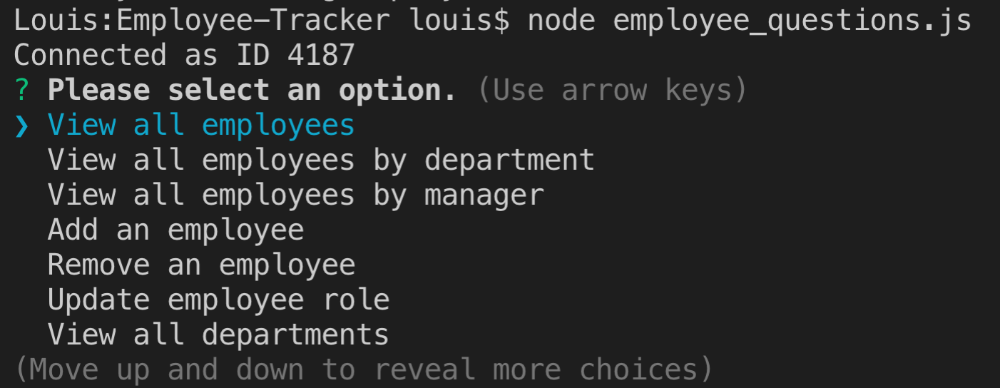
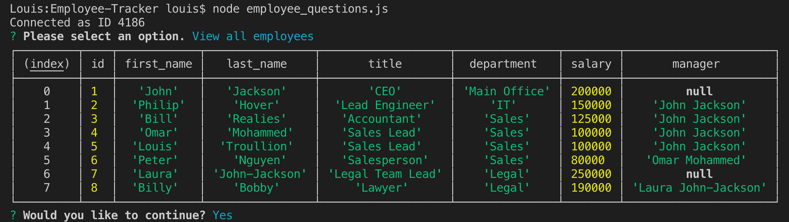

# Employee Tracker
An app to help keep track of the employees within a company. Add, remove, and update all of your employee info in one convenient location.

## Video Example
https://youtu.be/jldQhF6AulM

## Table of Contents:
* [Installation](#installation)
* [Usage](#usage)
* [Credits](#credits)
* [Contributing](#contributing)
* [Tests](#tests)
* [Questions](#questions) 

## Installation:
It's important to run "npm install" in your terminal before launching this application to ensure you have all the necessary files.

## Usage:
Once you have run npm install in your terminal, please type "node server.js" into your terminal. Once you have you will recieved a prompt telling you that the app is successfully listening on PORT 3000. From here simply type select whichever option you would like to use, and follow the prompts.

## Credits:
None

## Contributing:
This project is open source, so please feel free to use it in any way you see fit! If you have any questions please feel free to get in touch with me through one of the links in the "Questions" section below.

## Tests:
Test the employee tracker application once before creating final copy, just to ensure everything is to your liking.

## Questions:
* Louis Yacksmith
* https://github.com/LouisYS-Carleton
* louisyacksmith@hotmail.com
* https://www.linkedin.com/in/louis-yacksmith-2a06321b2/
